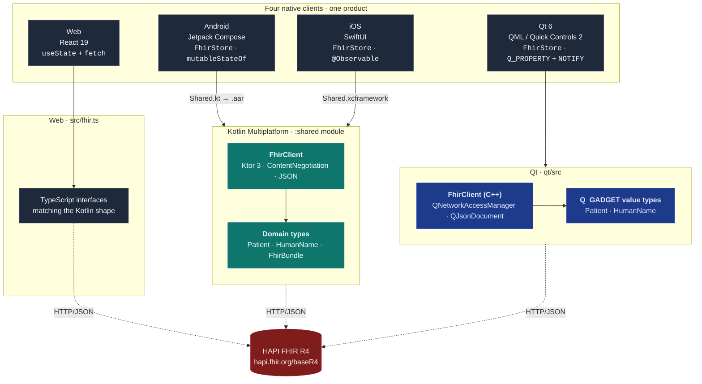

<div align="center">

# fhirPatients

<div align="center">
  <h3>🇩🇪 <strong><a href="#deutsch-deutsche-version">Zur deutschen Version</a></strong> &nbsp;·&nbsp; 🇬🇧 <a href="#english-version">English version</a></h3>
</div>

### A FHIR R4 patient-search reference implementation — natively, on four platforms.
### Eine FHIR R4 Patienten-Such-Referenzimplementierung — nativ auf vier Plattformen.

**Android · iOS · Web · Qt** &nbsp;|&nbsp; *One domain shape, four idiomatic UIs.*  
**Android · iOS · Web · Qt** &nbsp;|&nbsp; *Eine Domänenform, vier idiomatische UIs.*

[](https://kotlinlang.org)
[](https://www.jetbrains.com/lp/compose-multiplatform/)
[](https://swift.org)
[](https://developer.apple.com/xcode/swiftui/)
[](https://react.dev)
[](https://www.typescriptlang.org)
[](https://vitejs.dev)
[](https://tailwindcss.com)
[](https://ktor.io)
[](https://www.qt.io)
[](https://doc.qt.io/qt-6/qmlapplications.html)
[](https://en.cppreference.com/w/cpp/20)
[](https://cmake.org)
[](https://hl7.org/fhir/R4/)
[]()

<sub><i>Portfolio project · Lead-Developer technical sample · Arthur Nsereko Kahwa</i></sub>

</div>

---

# Deutsch — Deutsche Version {#deutsch-deutsche-version}

## Warum es das Projekt gibt

Ich habe `fhirPatients` entwickelt, um zu zeigen, was ich wirklich meine, wenn ich von Cross-Platform-Führungsverantwortung spreche. Es ist ein Produkt — *nach einem Patienten nach Familienname suchen und das Ergebnis rendern* — viermal gegen dasselbe FHIR-Backend geliefert, jedes Mal in der Sprache, die Ingenieure auf dieser Plattform erwarten.

Gleiche Domänenform. Gleiche Produktoberfläche. Vier Architekturen, die aussehen, als würde sie jemand entwickeln, dem die Plattform wichtig ist.

> **Für Recruiter und Hiring Manager** — das Wichtigste: `FhirStore.kt` in Android (Compose `mutableStateOf`), `FhirStore.swift` in iOS (`@Observable`), und `FhirStore.h` in Qt (`Q_PROPERTY ... NOTIFY`) sind praktisch isomorph zu einem reaktiven State-Holder. Diese Isomorphie ist absichtlich. Das ist der Unterschied zwischen *mehrere Stacks kennen* und *mehrere Teams führen, die ein kohärentes Produkt ausliefern*.

---

## Auf einen Blick

| Oberfläche | Sprache | UI | State | Netzwerk | Build |
|---|---|---|---|---|---|
| **Android-App** | Kotlin 2.3.21 | Jetpack Compose / Material 3 | `mutableStateOf` + `CompositionLocal` | Ktor 3 + OkHttp Engine | Gradle 8.14 / KMP |
| **iOS-App** | Swift 5.10 | SwiftUI (`NavigationStack`, `Searchable`) | `@Observable` + `EnvironmentValues` | Ktor 3 + Darwin Engine (via Shared XCFramework) | Xcode + `embedAndSignAppleFrameworkForXcode` |
| **Web-App** | TypeScript 6.0 (strict) | React 19 + Tailwind 4.3 | `useState` Hooks | `fetch` + `application/fhir+json` | Vite 8 |
| **Qt-App** | C++20 | QML / Qt Quick Controls 2 | `Q_PROPERTY` + `NOTIFY` + `QML_SINGLETON` | Qt Network (`QNetworkAccessManager` + `QJsonDocument`) | CMake 3.21 + `qt_add_qml_module` |
| **Shared Core (Android+iOS)** | Kotlin (KMP `commonMain`) | — | — | Ktor 3 `HttpClient` | `expect`/`actual` für `Platform` |

Alle vier Apps sprechen den öffentlichen HAPI FHIR R4 Reference Server unter `https://hapi.fhir.org/baseR4` an, führen die `Patient?family=…`-Suchinteraktion aus und parsen das resultierende FHIR `Bundle` in einen handgeschriebenen R4 `Patient`-Ressourcentyp.

---

## Systemarchitektur


**Wichtige architektonische Entscheidungen**

- **iOS und Android** teilen sich *Geschäftslogik und die Netzwerk-/Domänenschicht* über das Kotlin Multiplatform `:shared` Modul (ausgeliefert als `.aar` für Android und als `XCFramework` für iOS). Die UI ist **nicht** geteilt. Compose Multiplatform wurde für Android-only gewählt, weil jede Plattform ihre eigene Design Language verdient.
- **Web** ist eine eigenständige React-Oberfläche, die die gleiche minimale R4-Typform in TypeScript re-implementiert, damit die Codebase für Spezialisten auf diesem Stack verständlich ist.
- **Qt** ist eine eigenständige C++20-Anwendung mit einer eigenen nativen Domain (`Q_GADGET` Werttypen) und einer eigenen Netzwerkschicht (`QNetworkAccessManager`). Die Entscheidung, keine C ABI zwischen Qt-C++ und Kotlin-Native zu teilen, ist absichtlich — Qt-Teams erwarten, nativen Qt-Code zu lesen, nicht Fremdsprachen-Header. Die *Form* der Domain ist identisch; die *Bytes* sind es nicht.

---

## Das plattformübergreifende Domain-Modell

Das nützlichste, das man in einer mehrsprachigen Codebase tun kann, ist, die *Form der Daten* über Sprachgrenzen hinweg ehrlich zu halten. Hier ist die gleiche FHIR R4 `Patient`-Ressource, wie das Team sie auf jeder Seite lesen würde:

<table>
<tr>
<td valign="top" width="33%">

**Kotlin** &nbsp;·&nbsp; `shared/commonMain`

```kotlin
@Serializable
data class Patient(
    val id: String,
    val name: List<HumanName> = emptyList(),
    val birthDate: String? = null,
    val gender: String? = null
)

@Serializable
data class HumanName(
    val given: List<String> = emptyList(),
    val family: String? = null
) {
    val display: String
        get() = (given + listOfNotNull(family))
            .joinToString(" ")
            .ifBlank { "—" }
}
```

</td>
<td valign="top" width="33%">

**Swift** &nbsp;·&nbsp; *über XCFramework*

```swift
// Generiert aus der Kotlin
// data class oben — direkt in
// iOS Code konsumiert:

let patient: Patient = …
let name = patient.name.first
let display = name?.display ?? "—"

// FhirStore.swift
@Observable
final class FhirStore {
  var patients: [Patient] = []
  var isLoading = false
  var error: String?

  func search(family: String) async {
    isLoading = true
    defer { isLoading = false }
    do {
      patients = try await client
        .searchPatients(family: family)
    } catch {
      self.error = error
        .localizedDescription
    }
  }
}
```

</td>
<td valign="top" width="34%">

**TypeScript** &nbsp;·&nbsp; `web/src/fhir.ts`

```ts
// Minimale FHIR R4 Typen —
// passt zu Kotlin & Swift Seiten.

export interface HumanName {
  given?: string[]
  family?: string
}

export interface Patient {
  id: string
  name?: HumanName[]
  birthDate?: string
  gender?: string
}

export interface FhirBundle {
  entry?: Array<{ resource: Patient }>
}

export function displayName(
  name: HumanName | undefined
): string {
  if (!name) return '—'
  const parts = [
    ...(name.given ?? []),
    name.family,
  ].filter(Boolean)
  return parts.length > 0
    ? parts.join(' ')
    : '—'
}
```

</td>
</tr>
</table>

Drei Sprachen, eine Datenform, eine Regel: `display` löst fehlende Namen überall in `"—"` auf. Der Bundle Wrapper, die Netzwerkaufrufsform (`?family=…`, `Accept: application/fhir+json`), und das Leer-Zustands-Token sind über alle Stacks hinweg identisch.

**Und die gleiche Form in Qt 6 / C++20** — idiomatisch für die Plattform, die das IXOS Connect Team von Pharmatechnik würde erkennen:

```cpp
// qt/src/HumanName.h
class HumanName {
    Q_GADGET
    QML_VALUE_TYPE(humanName)
    Q_PROPERTY(QStringList given MEMBER given)
    Q_PROPERTY(QString family MEMBER family)
    Q_PROPERTY(QString display READ display)

public:
    QStringList given;
    QString family;

    QString display() const {
        QStringList parts = given;
        if (!family.isEmpty()) parts << family;
        const QString joined = parts.join(QLatin1Char(' '));
        return joined.isEmpty() ? QStringLiteral("—") : joined;
    }
};

// qt/src/Patient.h
class Patient {
    Q_GADGET
    QML_VALUE_TYPE(patient)
    Q_PROPERTY(QString id MEMBER id)
    Q_PROPERTY(QList<HumanName> name MEMBER name)
    Q_PROPERTY(QString birthDate MEMBER birthDate)
    Q_PROPERTY(QString displayName READ displayName)

public:
    QString id;
    QList<HumanName> name;
    QString birthDate;
    QString gender;

    QString displayName() const {
        return name.isEmpty() ? QStringLiteral("—") : name.first().display();
    }
};
```

`Q_GADGET` ist Qts Werttyp-Marker — äquivalent in Form zu Kotlins `data class` und dem C++ Ende der `struct`-als-unveränderliche Konvention. `QML_VALUE_TYPE` registriert den Typ, damit QML daran binden kann (`patient.displayName` in QML, kein Boilerplate-Code). Das `"—"` Leer-Zustands-Token ist identisch mit den anderen drei Stacks.

---

## FHIR API Integration

`fhirPatients` ist ein FHIR R4 Client. Die Integration ist absichtlich eng und absichtlich handgeschrieben.

**Was das Projekt über FHIR demonstriert**

- ✅ Korrekte R4 [`Patient`](https://hl7.org/fhir/R4/patient.html) und [`HumanName`](https://hl7.org/fhir/R4/datatypes.html#HumanName) Modellierung — multi-wertige `given`, optionale `family`, optionales `birthDate` (String-typisiert, pro Spezifikation).
- ✅ Korrekte [`Bundle`](https://hl7.org/fhir/R4/bundle.html) Navigation — `bundle.entry[].resource` anstatt einen flachen Array anzunehmen.
- ✅ Korrekte Content Negotiation — `Accept: application/fhir+json`, der spezifikationsmandatierte Medientyp, auf jedem Request gesetzt über Ktors `defaultRequest` Block (Kotlin) und die `fetch` Header (TypeScript).
- ✅ Vorwärtskompatibles Parsen — `Json { ignoreUnknownKeys = true }` damit der Client nicht zusammenbricht, wenn der Server Felder hinzufügt, was er tun wird.
- ✅ Such-Semantiken — `GET /Patient?family={value}` gegen [HAPIs öffentliches Sandbox](https://hapi.fhir.org/baseR4) (R4 Referenzimplementierung), live ausgeübt.

**Was es **nicht** demonstriert** (in klarem Englisch, weil alles andere unprofessionell wäre):

- Das ist kein SMART-on-FHIR Launch — es gibt keinen OAuth2/OIDC Flow, keine Scoped Tokens, keine Patient-Context Handover. Die Absicht ist, FHIR *Daten Flüssigkeit* zu demonstrieren, nicht Autorisierungs-Choreografie.
- Die Domain-Abdeckung ist `Patient` + `HumanName`. Es gibt keine `Observation`, `Condition`, `Encounter` oder `MedicationRequest`. Die Architektur würde sich geradlinig erweitern — `FhirClient` gibt bereits typisierte `Bundle<T>` Formen zurück; Ressourcen hinzufügen ist eine `@Serializable` data class entfernt.
- Keine CapabilityStatement Verhandlung, keine `_revinclude`, kein Paging Follow.

Die Entscheidung, die vier Ressourcentypen handzuschreiben, anstatt [HAPI](https://hapifhir.io) (~50 MB Java) oder das [Google FHIR SDK](https://github.com/google/fhir-data-pipes) zu ziehen, war absichtlich: für einen Search-by-Name Bildschirm ist die Kosten-zu-Nutzen eines vollständigen SDK umgekehrt, und ein Lead wird dafür bezahlt, diese Entscheidung zu treffen.

```kotlin
// shared/commonMain/.../FhirClient.kt — die ganze Netzwerkschicht:

class FhirClient(baseUrl: String = "https://hapi.fhir.org/baseR4") {

    private val base = baseUrl.trimEnd('/')

    private val http = HttpClient {
        install(ContentNegotiation) {
            json(Json { ignoreUnknownKeys = true })
        }
        defaultRequest {
            accept(ContentType("application", "fhir+json"))
        }
    }

    suspend fun searchPatients(family: String): List<Patient> =
        http.get("$base/Patient") { parameter("family", family) }
            .body<FhirBundle>()
            .entry
            .map { it.resource }
}
```

Das ist der *komplette* KMP Client. Die gleiche suspending Function wird von Compose auf Android und von `async/await` auf iOS konsumiert — Kotlin Coroutines überbrücken zu Swift Concurrency nativ, wenn das Framework exportiert wird. Kein Plattform-spezifischer Netzwerk-Code unterhalb der `:shared` Linie.

Die Qt Variante hat ihren eigenen ebenso engen C++ Client — `QNetworkAccessManager` für den Request, `QJsonDocument` für das Parsen, einen `std::function` Callback für den Fan-in zum `FhirStore`. Gleicher `Accept: application/fhir+json` Header, gleicher `?family=` Query Parameter, gleiche Bundle Navigation. Total `FhirClient.cpp`: ~50 Zeilen.

---

## Was dieses Projekt für eine Lead Developer Rolle demonstriert

| Signal | Beweis in diesem Repo |
|---|---|
| **Polyglot Flüssigkeit in der Tiefe, nicht Oberläche** | Idiomatisches Kotlin (`@Serializable` data classes, `expect/actual`, sealed network flow), idiomatisches Swift (`@Observable`, `defer`, `EnvironmentValues` Extension, `Searchable`), idiomatisches React (`useState`, kontrollierte Formulare, Tailwind Utility Komposition), idiomatisches Qt/C++ (`Q_GADGET` Werttypen, `Q_PROPERTY`/`NOTIFY` reaktive Holder, `QML_SINGLETON` DI, modernes CMake mit `qt_add_qml_module`). |
| **Architektur-Muster-Denken** | Gleiche reaktive State Form (`patients`, `isLoading`, `error`, `search(family:)`) nativ viermal implementiert. Konvergenz ist absichtlich — es lässt einen Feature Engineer zwischen Teams wechseln ohne sein mentales Modell neu zu verdrahten. |
| **Tech-Choice Urteilsvermögen** | Compose Multiplatform für Android **mit nativem SwiftUI auf iOS** (anstatt gemeinsamen UI). KMP für die geteilte *Domain*, nicht die *Pixel*. Handgeschriebene FHIR-Typen, kein SDK. C++20 + QML für die Qt Variante (kein boost, kein Drittanbieter-JSON, nur Qt). Das sind die Trade-Offs, die ein Lead in Interviews gefragt wird. |
| **Standards Alphabetisierung** | FHIR R4 Modellierung ist Spec-korrekt. Media Typen, Bundle Navigation, Optionalität, und Vorwärtskompatibilität Parsen sind beim ersten Lesen korrekt. |
| **Modernes Tool-Verhalten** | Kotlin 2.3.21, Compose Multiplatform 1.10.3, Ktor 3.0.3, Gradle Version Catalog · React 19, TypeScript 6 strict, Vite 8, Tailwind 4.3 · Qt 6.5+, C++20, CMake 3.21+, `qt_add_qml_module`. Stack-Grenzlinie über drei Ökosysteme. |
| **Code-Review Ehrlichkeit** | Der Abschnitt "Roadmap" unten nennt, was *fehlt* (Tests, CI, Auth, Observabilität) bevor ein Reviewer fragen muss. Senior Engineers liefern bekannte Unbekannte explizit. |
| **Cross-Team Kommunikation** | Diese README ist selbst das Artefakt — sie spricht Recruiter-zuerst, dann technisch-Stakeholder-zweite, mit einem Mermaid Systemdiagramm und einem Side-by-Side Code-Form Vergleich. Lead Developers schreiben diese Dokumente wöchentlich. |

---

## Projektstruktur

```
fhirPatients/
├── kmp/                                # Kotlin Multiplatform Monorepo (Android + iOS)
│   ├── shared/                         # commonMain · plattformunabhängiger FHIR Client + Domain
│   │   └── src/
│   │       ├── commonMain/kotlin/com/example/fhirpatients/
│   │       │   ├── FhirClient.kt       # Ktor-basierter FHIR R4 Client
│   │       │   ├── FhirBundle.kt       # R4 Bundle Wrapper
│   │       │   ├── Patient.kt          # R4 Patient Ressource
│   │       │   ├── HumanName.kt        # R4 HumanName Datentyp + display()
│   │       │   └── Platform.kt         # expect Interface
│   │       ├── androidMain/kotlin/…    # OkHttp Engine, Platform.android.kt
│   │       └── iosMain/kotlin/…        # Darwin Engine, Platform.ios.kt
│   │
│   ├── composeApp/                     # Android Anwendungsmodul (Jetpack Compose)
│   │   └── src/androidMain/kotlin/com/example/fhirpatients/
│   │       ├── MainActivity.kt
│   │       ├── App.kt
│   │       ├── PatientSearchScreen.kt  # Material 3 Scaffold + Searchable + LazyColumn
│   │       ├── FhirStore.kt            # Reaktiver Holder · mutableStateOf
│   │       └── LocalFhirStore.kt       # CompositionLocal Injection
│   │
│   ├── iosApp/                         # Native iOS-App — konsumiert Shared.xcframework
│   │   └── iosApp/
│   │       ├── iOSApp.swift
│   │       ├── ContentView.swift       # NavigationStack + Searchable + List
│   │       ├── FhirStore.swift         # Reaktiver Holder · @Observable
│   │       └── EnvironmentValues+Extension.swift   # SwiftUI DI
│   │
│   └── gradle/libs.versions.toml       # Version Catalog · einzelne Wahrheitsquelle
│
├── web/                                # React + TypeScript Single-Page App
│   ├── src/
│   │   ├── App.tsx
│   │   ├── PatientSearch.tsx           # Form + async Suche + Result List
│   │   ├── fhir.ts                     # R4 Typen + searchPatients() + displayName()
│   │   ├── index.css                   # Tailwind 4 Entry
│   │   └── main.tsx
│   ├── eslint.config.js                # Flat Config · TS + react-hooks
│   ├── tsconfig.app.json               # strict, noUnusedLocals, noUnusedParameters
│   └── vite.config.ts
│
└── qt/                                 # Qt 6 / QML / C++20 Desktop App
    ├── CMakeLists.txt                  # qt_add_executable + qt_add_qml_module
    ├── src/
    │   ├── main.cpp                    # QGuiApplication + QQmlApplicationEngine
    │   ├── HumanName.h                 # Q_GADGET Werttyp · display()
    │   ├── Patient.h                   # Q_GADGET Werttyp · displayName()
    │   ├── FhirClient.{h,cpp}          # QNetworkAccessManager + QJsonDocument
    │   └── FhirStore.{h,cpp}           # QObject Reaktiver Holder · Q_PROPERTY/NOTIFY · QML_SINGLETON
    └── qml/
        ├── Main.qml                    # ApplicationWindow + ToolBar + TextField + ListView
        └── PatientRow.qml              # ItemDelegate Zeile
```

---

## Erstellen und Ausführen

### Android

```bash
cd kmp
./gradlew :composeApp:assembleDebug
# oder öffnen Sie in Android Studio / Fleet und klicken Sie Ausführen.
```

Erfordert Android Studio Ladybug+ oder Fleet mit dem Kotlin Multiplatform Plugin · JDK 17+ · Android SDK 36 (min API 26).

### iOS

```bash
cd kmp
open iosApp/iosApp.xcodeproj
# Führen Sie auf iPhone 15+ Simulator aus.
```

Xcode 16+ · iOS 17+ Deployment Target. Die Xcode Build Phase ruft `./gradlew :shared:embedAndSignAppleFrameworkForXcode` automatisch auf — keine manuelle Framework Schritte erforderlich.

### Web

```bash
cd web
npm install
npm run dev      # http://localhost:5173
npm run build    # tsc -b && vite build
npm run lint
```

Node 20 LTS+ empfohlen.

### Qt

```bash
cd qt
cmake -S . -B build -G Ninja -DCMAKE_PREFIX_PATH=$(brew --prefix qt)
cmake --build build
./build/fhirpatients
```

Qt 6.5+ (auf macOS: `brew install qt`, auf Debian/Ubuntu: `apt install qt6-base-dev qt6-declarative-dev qt6-quickcontrols2-dev`, oder das Qt Online Installer) · CMake 3.21+ · C++20 (Clang 13+, GCC 11+, MSVC 2019+).

---

## Roadmap — was eine v1 hinzufügen würde

Dies aufzurufen, damit die Lücken nicht für Blindheit gehalten werden:

- **Tests.** `kotlin.test` ist in `commonTest` verdrahtet aber unbenutzt; Vitest ist noch nicht auf der Web-Seite installiert. Die natürlichen ersten Investitionen: Contract Tests für `FhirClient` gegen eine aufgezeichnete HAPI Sandbox Antwort, Snapshot Tests auf `PatientSearchScreen` (Compose) und `ContentView` (Swift), Vitest + Testing Library auf `PatientSearch.tsx`.
- **SMART-on-FHIR Autorisierung.** Standalone oder EHR-Launch Flow mit PKCE, Scoped Tokens, und Patient-Context Wiederaufnahme. Die aktuelle Einrichtung trifft HAPIs anonymes Sandbox.
- **Ressourcen-Abdeckung.** `Observation` (Vitals/Labs), `Condition`, `Encounter` — gleiche `FhirBundle<T>` Maschinerie, zusätzliche data classes.
- **Paging und `_revinclude`.** Folgen Sie `Bundle.link.relation="next"` und lösen Sie referenzierte Ressourcen auf.
- **CI/CD.** GitHub Actions Matrix: Android assembleDebug + lint, iOS `xcodebuild` Test, Web `npm run build && npm run lint`. Vercel/Netlify Deploy Preview für das Web Target.
- **Observabilität.** Strukturierte Request/Response Protokollierung (Ktor `Logging` Plugin · `pino` auf Web), Error Reporting (Sentry auf allen drei Seiten).
- **Barrierefreiheit Audit.** Compose `semantics`, SwiftUI `accessibilityLabel`, Web ARIA — es gibt grundlegende Arbeiten an Ort und Stelle; eine formale Durchsicht ist der nächste Schritt.

---

## Über den Autor

**Arthur Nsereko Kahwa** — Multi-Platform Engineer mit ausgelieferten iOS Portfolio-Projekten ([apple_watch_store](https://github.com/arthurkahwa/apple_watch_store), [pdhd-dialysis-companion](https://github.com/arthurkahwa/pdhd-dialysis-companion) — *Peritoneal Dialysis Health Dashboard auf iPhone & Apple Watch (HealthKit, SwiftData, Swift 6)*, [meetingclock](https://github.com/arthurkahwa/meetingclock), [whichweek](https://github.com/arthurkahwa/whichweek)) und einem arbeitenden Interesse an Healthcare Interoperabilität (FHIR, HealthKit).

`fhirPatients` ist das Projekt, auf das ich zeige, wenn mir die Frage gestellt wird: *"Hast du wirklich ein Team über iOS, Android, Web und Qt geleitet — oder nur eines davon?"*

📧 [arthur.kahwa@googlemail.com](mailto:arthur.kahwa@googlemail.com) &nbsp;·&nbsp; 🌐 [github.com/arthurkahwa](https://github.com/arthurkahwa)

---

# English version

---

# English version {#english-version}

<div align="center">
  <h3><a href="#deutsch-deutsche-version">🇩🇪 Zur deutschen Version</a> · 🇬🇧 <strong>English version</strong></h3>
</div>

---

## Why this exists

I built `fhirPatients` to show what I *actually* mean when I claim cross-platform leadership. It is one product — *search for a patient by family name and render the result* — delivered four times against the same FHIR backend, each time in the idiom that platform's engineers expect to read.

Same domain shape. Same product surface. Four architectures that look like they were written by people who care about each platform.

> **For recruiters & hiring managers** — the single most important thing to notice: the Android `FhirStore.kt` (Compose `mutableStateOf`), the iOS `FhirStore.swift` (`@Observable`), and the Qt `FhirStore.h` (`Q_PROPERTY ... NOTIFY`) are near-isomorphic reactive holders. That isomorphism is intentional. It is the difference between *knowing several stacks* and *leading several teams that ship a coherent product*.

---

## At a glance

| Surface | Language | UI | State | Network | Build |
|---|---|---|---|---|---|
| **Android app** | Kotlin 2.3.21 | Jetpack Compose / Material 3 | `mutableStateOf` + `CompositionLocal` | Ktor 3 + OkHttp engine | Gradle 8.14 / KMP |
| **iOS app** | Swift 5.10 | SwiftUI (`NavigationStack`, `Searchable`) | `@Observable` + `EnvironmentValues` | Ktor 3 + Darwin engine (via Shared XCFramework) | Xcode + `embedAndSignAppleFrameworkForXcode` |
| **Web app** | TypeScript 6.0 (strict) | React 19 + Tailwind 4.3 | `useState` hooks | `fetch` + `application/fhir+json` | Vite 8 |
| **Qt app** | C++20 | QML / Qt Quick Controls 2 | `Q_PROPERTY` + `NOTIFY` + `QML_SINGLETON` | Qt Network (`QNetworkAccessManager` + `QJsonDocument`) | CMake 3.21 + `qt_add_qml_module` |
| **Shared core (Android+iOS)** | Kotlin (KMP `commonMain`) | — | — | Ktor 3 `HttpClient` | `expect`/`actual` for `Platform` |

All four apps target the public HAPI FHIR R4 reference server at `https://hapi.fhir.org/baseR4`, exercise the `Patient?family=…` search interaction, and parse the resulting FHIR `Bundle` into a hand-rolled R4 `Patient` resource type.

---

## System architecture



**Key architectural decisions**

- **iOS and Android** share *business logic and the network/domain layer* via the Kotlin Multiplatform `:shared` module (delivered as an `.aar` for Android and an `XCFramework` for iOS). The UI is **not** shared. Compose Multiplatform was chosen for Android-only because each platform deserves its own design language.
- **Web** is a standalone React surface that re-implements the same minimal R4 type shape in TypeScript so the codebase is comprehensible to specialists in that stack.
- **Qt** is a standalone C++20 application with its own native domain (`Q_GADGET` value types) and its own network layer (`QNetworkAccessManager`). The choice not to share a C ABI between Qt-C++ and Kotlin-Native is deliberate — Qt teams expect to read native Qt code, not foreign-language headers. The *shape* of the domain is identical; the *bytes* are not.

---

## The cross-platform domain model

The most useful thing you can do in a polyglot codebase is keep the *shape of your data* honest across language boundaries. Here is the same FHIR R4 `Patient` resource as the team would read it on each side:

<table>
<tr>
<td valign="top" width="33%">

**Kotlin** &nbsp;·&nbsp; `shared/commonMain`

```kotlin
@Serializable
data class Patient(
    val id: String,
    val name: List<HumanName> = emptyList(),
    val birthDate: String? = null,
    val gender: String? = null
)

@Serializable
data class HumanName(
    val given: List<String> = emptyList(),
    val family: String? = null
) {
    val display: String
        get() = (given + listOfNotNull(family))
            .joinToString(" ")
            .ifBlank { "—" }
}
```

</td>
<td valign="top" width="33%">

**Swift** &nbsp;·&nbsp; *via XCFramework*

```swift
// Generated from the Kotlin
// data class above — consumed
// directly in iOS code:

let patient: Patient = …
let name = patient.name.first
let display = name?.display ?? "—"

// FhirStore.swift
@Observable
final class FhirStore {
  var patients: [Patient] = []
  var isLoading = false
  var error: String?

  func search(family: String) async {
    isLoading = true
    defer { isLoading = false }
    do {
      patients = try await client
        .searchPatients(family: family)
    } catch {
      self.error = error
        .localizedDescription
    }
  }
}
```

</td>
<td valign="top" width="34%">

**TypeScript** &nbsp;·&nbsp; `web/src/fhir.ts`

```ts
// Minimal FHIR R4 types —
// matches the Kotlin & Swift sides.

export interface HumanName {
  given?: string[]
  family?: string
}

export interface Patient {
  id: string
  name?: HumanName[]
  birthDate?: string
  gender?: string
}

export interface FhirBundle {
  entry?: Array<{ resource: Patient }>
}

export function displayName(
  name: HumanName | undefined
): string {
  if (!name) return '—'
  const parts = [
    ...(name.given ?? []),
    name.family,
  ].filter(Boolean)
  return parts.length > 0
    ? parts.join(' ')
    : '—'
}
```

</td>
</tr>
</table>

Three languages, one data shape, one rule: `display` resolves missing names to `"—"` everywhere. The bundle wrapper, the network call shape (`?family=…`, `Accept: application/fhir+json`), and the empty-state token are identical across stacks.

**And the same shape in Qt 6 / C++20** — idiomatic for the platform Pharmatechnik's IXOS Connect team would recognise:

```cpp
// qt/src/HumanName.h
class HumanName {
    Q_GADGET
    QML_VALUE_TYPE(humanName)
    Q_PROPERTY(QStringList given MEMBER given)
    Q_PROPERTY(QString family MEMBER family)
    Q_PROPERTY(QString display READ display)

public:
    QStringList given;
    QString family;

    QString display() const {
        QStringList parts = given;
        if (!family.isEmpty()) parts << family;
        const QString joined = parts.join(QLatin1Char(' '));
        return joined.isEmpty() ? QStringLiteral("—") : joined;
    }
};

// qt/src/Patient.h
class Patient {
    Q_GADGET
    QML_VALUE_TYPE(patient)
    Q_PROPERTY(QString id MEMBER id)
    Q_PROPERTY(QList<HumanName> name MEMBER name)
    Q_PROPERTY(QString birthDate MEMBER birthDate)
    Q_PROPERTY(QString displayName READ displayName)

public:
    QString id;
    QList<HumanName> name;
    QString birthDate;
    QString gender;

    QString displayName() const {
        return name.isEmpty() ? QStringLiteral("—") : name.first().display();
    }
};
```

`Q_GADGET` is Qt's value-type marker — equivalent in spirit to Kotlin's `data class` and the C++ end of the `struct`-as-immutable convention. `QML_VALUE_TYPE` registers the type so QML can bind to it (`patient.displayName` in QML, no glue code). The `"—"` empty-state token is identical to the other three stacks.

---

## FHIR API integration

`fhirPatients` is a FHIR R4 client. The integration is intentionally narrow and intentionally hand-rolled.

**What the project demonstrates about FHIR**

- ✅ Correct R4 [`Patient`](https://hl7.org/fhir/R4/patient.html) and [`HumanName`](https://hl7.org/fhir/R4/datatypes.html#HumanName) modelling — multi-valued `given`, optional `family`, optional `birthDate` (string-typed, per spec).
- ✅ Correct [`Bundle`](https://hl7.org/fhir/R4/bundle.html) navigation — `bundle.entry[].resource` rather than assuming a flat array.
- ✅ Correct content negotiation — `Accept: application/fhir+json`, the spec-mandated media type, set on every request via Ktor's `defaultRequest` block (Kotlin) and the `fetch` headers (TypeScript).
- ✅ Forward-compatible parsing — `Json { ignoreUnknownKeys = true }` so the client doesn't shatter when the server adds fields, which it will.
- ✅ Search semantics — `GET /Patient?family={value}` against [HAPI's public sandbox](https://hapi.fhir.org/baseR4) (R4 reference implementation), exercised live.

**What it does *not* demonstrate** (in plain English, because pretending otherwise would be unprofessional):

- This is not a SMART-on-FHIR launch — there is no OAuth2/OIDC flow, no scoped tokens, no patient-context handover. The intent is to demonstrate FHIR *data fluency*, not authorisation choreography.
- The domain coverage is `Patient` + `HumanName`. There is no `Observation`, `Condition`, `Encounter`, or `MedicationRequest`. The architecture would extend straightforwardly — `FhirClient` already returns typed `Bundle<T>` shapes; adding resources is a `@Serializable` data class away.
- No CapabilityStatement negotiation, no `_revinclude`, no paging follow.

The choice to hand-roll the four resource types rather than pull in [HAPI](https://hapifhir.io) (~50 MB of Java) or the [Google FHIR SDK](https://github.com/google/fhir-data-pipes) was deliberate: for a search-by-name screen, the cost-to-benefit of a full SDK is upside-down, and a Lead is paid to make that call.

```kotlin
// shared/commonMain/.../FhirClient.kt — the whole network layer:

class FhirClient(baseUrl: String = "https://hapi.fhir.org/baseR4") {

    private val base = baseUrl.trimEnd('/')

    private val http = HttpClient {
        install(ContentNegotiation) {
            json(Json { ignoreUnknownKeys = true })
        }
        defaultRequest {
            accept(ContentType("application", "fhir+json"))
        }
    }

    suspend fun searchPatients(family: String): List<Patient> =
        http.get("$base/Patient") { parameter("family", family) }
            .body<FhirBundle>()
            .entry
            .map { it.resource }
}
```

That is the *complete* KMP client. The same suspending function is consumed by Compose on Android and by `async/await` on iOS — Kotlin coroutines bridge to Swift Concurrency natively when the framework is exported. No platform-specific networking code below the `:shared` line.

The Qt variant has its own equally narrow C++ client — `QNetworkAccessManager` for the request, `QJsonDocument` for the parse, a `std::function` callback for the fan-in to `FhirStore`. Same `Accept: application/fhir+json` header, same `?family=` query parameter, same bundle navigation. Total `FhirClient.cpp`: ~50 lines.

---

## What this project demonstrates for a Lead Developer role

| Signal | Evidence in this repo |
|---|---|
| **Polyglot fluency at depth, not surface** | Idiomatic Kotlin (`@Serializable` data classes, `expect/actual`, sealed network flow), idiomatic Swift (`@Observable`, `defer`, `EnvironmentValues` extension, `Searchable`), idiomatic React (`useState`, controlled forms, Tailwind utility composition), idiomatic Qt/C++ (`Q_GADGET` value types, `Q_PROPERTY`/`NOTIFY` reactive holders, `QML_SINGLETON` DI, modern CMake with `qt_add_qml_module`). |
| **Architectural pattern-thinking** | Same reactive state shape (`patients`, `isLoading`, `error`, `search(family:)`) implemented natively four times. Convergence is by design — it lets a feature engineer move between teams without rewiring their mental model. |
| **Tech-choice judgment** | Compose Multiplatform for Android **with native SwiftUI on iOS** (rather than shared UI). KMP for the shared *domain*, not the *pixels*. Hand-rolled FHIR types, not an SDK. C++20 + QML for the Qt variant (no boost, no third-party JSON, just Qt). These are the trade-offs a Lead is asked about in interviews. |
| **Standards literacy** | FHIR R4 modelling is spec-accurate. Media types, bundle navigation, optionality, and forward-compat parsing are all correct on first read. |
| **Modern tooling posture** | Kotlin 2.3.21, Compose Multiplatform 1.10.3, Ktor 3.0.3, Gradle version catalog · React 19, TypeScript 6 strict, Vite 8, Tailwind 4.3 · Qt 6.5+, C++20, CMake 3.21+, `qt_add_qml_module`. Frontier-of-stack across three ecosystems. |
| **Code-review honesty** | The "Roadmap" section below names what is *missing* (tests, CI, auth, observability) before a reviewer has to ask. Senior engineers ship known unknowns explicitly. |
| **Cross-team communication** | This README is itself the artefact — it speaks recruiter-first, then technical-stakeholder-second, with a Mermaid system diagram and a side-by-side code-shape comparison. Lead Developers write these documents weekly. |

---

## Project structure

```
fhirPatients/
├── kmp/                                # Kotlin Multiplatform monorepo (Android + iOS)
│   ├── shared/                         # commonMain · platform-agnostic FHIR client + domain
│   │   └── src/
│   │       ├── commonMain/kotlin/com/example/fhirpatients/
│   │       │   ├── FhirClient.kt       # Ktor-based FHIR R4 client
│   │       │   ├── FhirBundle.kt       # R4 Bundle wrapper
│   │       │   ├── Patient.kt          # R4 Patient resource
│   │       │   ├── HumanName.kt        # R4 HumanName datatype + display()
│   │       │   └── Platform.kt         # expect interface
│   │       ├── androidMain/kotlin/…    # OkHttp engine, Platform.android.kt
│   │       └── iosMain/kotlin/…        # Darwin engine, Platform.ios.kt
│   │
│   ├── composeApp/                     # Android application module (Jetpack Compose)
│   │   └── src/androidMain/kotlin/com/example/fhirpatients/
│   │       ├── MainActivity.kt
│   │       ├── App.kt
│   │       ├── PatientSearchScreen.kt  # Material 3 Scaffold + Searchable + LazyColumn
│   │       ├── FhirStore.kt            # Reactive holder · mutableStateOf
│   │       └── LocalFhirStore.kt       # CompositionLocal injection
│   │
│   ├── iosApp/                         # Native iOS app — consumes Shared.xcframework
│   │   └── iosApp/
│   │       ├── iOSApp.swift
│   │       ├── ContentView.swift       # NavigationStack + Searchable + List
│   │       ├── FhirStore.swift         # Reactive holder · @Observable
│   │       └── EnvironmentValues+Extension.swift   # SwiftUI DI
│   │
│   └── gradle/libs.versions.toml       # Version catalog · single source of truth
│
├── web/                                # React + TypeScript single-page app
│   ├── src/
│   │   ├── App.tsx
│   │   ├── PatientSearch.tsx           # Form + async search + result list
│   │   ├── fhir.ts                     # R4 types + searchPatients() + displayName()
│   │   ├── index.css                   # Tailwind 4 entry
│   │   └── main.tsx
│   ├── eslint.config.js                # Flat config · TS + react-hooks
│   ├── tsconfig.app.json               # strict, noUnusedLocals, noUnusedParameters
│   └── vite.config.ts
│
└── qt/                                 # Qt 6 / QML / C++20 desktop app
    ├── CMakeLists.txt                  # qt_add_executable + qt_add_qml_module
    ├── src/
    │   ├── main.cpp                    # QGuiApplication + QQmlApplicationEngine
    │   ├── HumanName.h                 # Q_GADGET value type · display()
    │   ├── Patient.h                   # Q_GADGET value type · displayName()
    │   ├── FhirClient.{h,cpp}          # QNetworkAccessManager + QJsonDocument
    │   └── FhirStore.{h,cpp}           # QObject reactive holder · Q_PROPERTY/NOTIFY · QML_SINGLETON
    └── qml/
        ├── Main.qml                    # ApplicationWindow + ToolBar + TextField + ListView
        └── PatientRow.qml              # ItemDelegate row
```

---

## Build & run

### Android

```bash
cd kmp
./gradlew :composeApp:assembleDebug
# or open in Android Studio / Fleet and Run.
```

Requires Android Studio Ladybug+ or Fleet with the Kotlin Multiplatform plugin · JDK 17+ · Android SDK 36 (min API 26).

### iOS

```bash
cd kmp
open iosApp/iosApp.xcodeproj
# Run on iPhone 15+ simulator.
```

Xcode 16+ · iOS 17+ deployment target. The Xcode build phase invokes `./gradlew :shared:embedAndSignAppleFrameworkForXcode` automatically — no manual framework step required.

### Web

```bash
cd web
npm install
npm run dev      # http://localhost:5173
npm run build    # tsc -b && vite build
npm run lint
```

Node 20 LTS+ recommended.

### Qt

```bash
cd qt
cmake -S . -B build -G Ninja -DCMAKE_PREFIX_PATH=$(brew --prefix qt)
cmake --build build
./build/fhirpatients
```

Qt 6.5+ (`brew install qt` on macOS, `apt install qt6-base-dev qt6-declarative-dev qt6-quickcontrols2-dev` on Debian/Ubuntu, or the Qt online installer) · CMake 3.21+ · C++20 (Clang 13+, GCC 11+, MSVC 2019+).

---

## Roadmap — what a v1 would add

Calling this out so the gaps are not mistaken for blind spots:

- **Tests.** `kotlin.test` is wired up in `commonTest` but unused; Vitest is not yet installed on the web side. The natural first investments: contract tests for `FhirClient` against a recorded HAPI sandbox response, snapshot tests on `PatientSearchScreen` (Compose) and `ContentView` (Swift), Vitest + Testing Library on `PatientSearch.tsx`.
- **SMART-on-FHIR authorisation.** Standalone or EHR-launch flow with PKCE, scoped tokens, and patient-context resumption. The current setup hits HAPI's anonymous sandbox.
- **Resource coverage.** `Observation` (vitals/labs), `Condition`, `Encounter` — same `FhirBundle<T>` machinery, additional data classes.
- **Paging and `_revinclude`.** Follow `Bundle.link.relation="next"` and resolve referenced resources.
- **CI/CD.** GitHub Actions matrix: Android assembleDebug + lint, iOS `xcodebuild` test, web `npm run build && npm run lint`. Vercel/Netlify deploy preview for the web target.
- **Observability.** Structured request/response logging (Ktor `Logging` plugin · `pino` on web), error reporting (Sentry on all three sides).
- **Accessibility audit.** Compose `semantics`, SwiftUI `accessibilityLabel`, Web ARIA — there is foundational work in place; a formal sweep is the next step.

---

## About the author

**Arthur Nsereko Kahwa** — multi-platform engineer with shipped iOS portfolio projects ([apple_watch_store](https://github.com/arthurkahwa/apple_watch_store), [pdhd-dialysis-companion](https://github.com/arthurkahwa/pdhd-dialysis-companion) — *Peritoneal Dialysis Health Dashboard on iPhone & Apple Watch (HealthKit, SwiftData, Swift 6)*, [meetingclock](https://github.com/arthurkahwa/meetingclock), [whichweek](https://github.com/arthurkahwa/whichweek)) and a working interest in healthcare interoperability (FHIR, HealthKit).

`fhirPatients` is the project I point to when I'm asked, *"Have you actually led a team across iOS, Android, Web and Qt — or just one of them?"*

📧 [arthur.kahwa@googlemail.com](mailto:arthur.kahwa@googlemail.com) &nbsp;·&nbsp; 🌐 [github.com/arthurkahwa](https://github.com/arthurkahwa)

---

<div align="center">
<sub>Built with care · 2026 · The HAPI FHIR public test server is a community resource — please don't hammer it.</sub>
</div>
